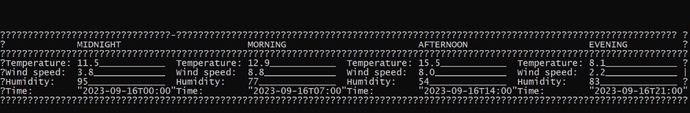

# [ Пример старого кода ]
# Прогноз погоды

Консольное приложение, отображающие прогноз погоды для выбранного списка городов.

## Источник данных

- [Open-Meteo](https://open-meteo.com/en/docs#latitude=59.94&longitude=30.31&hourly=temperature_2m&forecast_days=16) для прогноза
- [Api-Ninjas](https://api-ninjas.com/api/city) для определения координат по названию города

Список городов, частота обновления, количество дней прогноза определены в конфиге

## Отображение

В качестве библиотеки для запросов используется [C++ Requests](https://github.com/libcpr/cpr)
